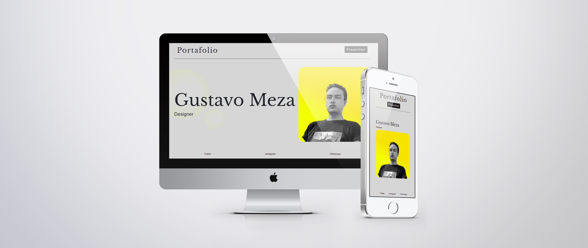

<h1 align="center"> Portafolio </h1>

    <h3>
        <a href="https://gustavo-exe.github.io/Portafolio/">
        Demo
        </a>
    </h3>

## Acerca de
Portafolio el cual contendra todos los proyectos realizados
en la clase desarrollo de portales web 2.

## Vista previa

## Construido con
- HTML 5
- CSS
- Bootstrap

